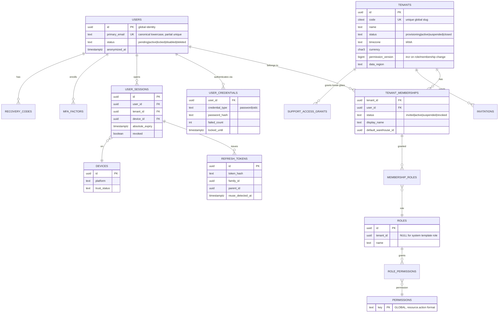
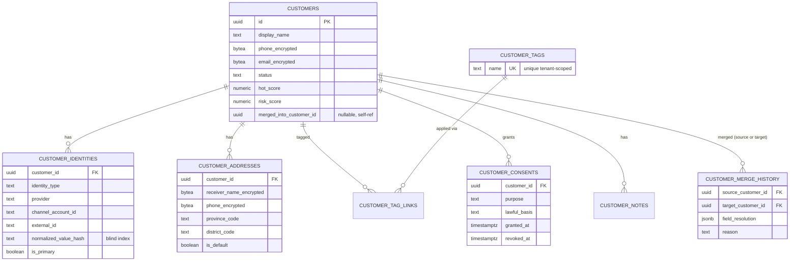
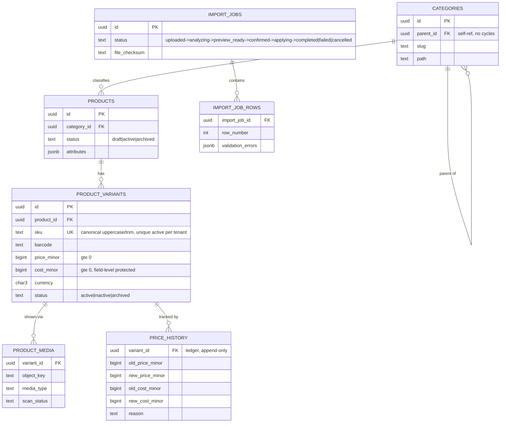
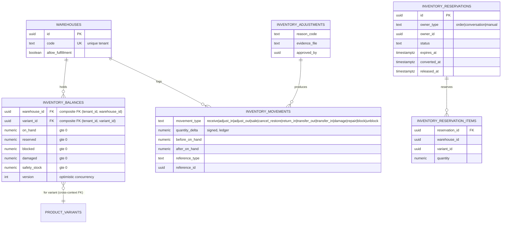
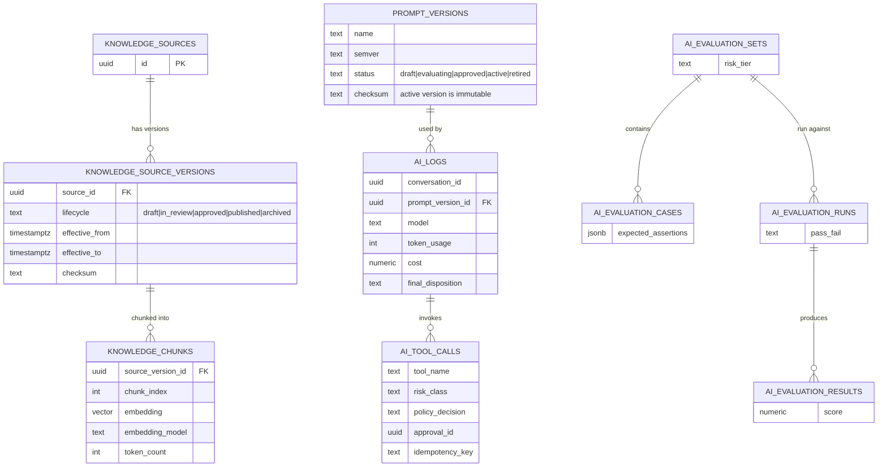
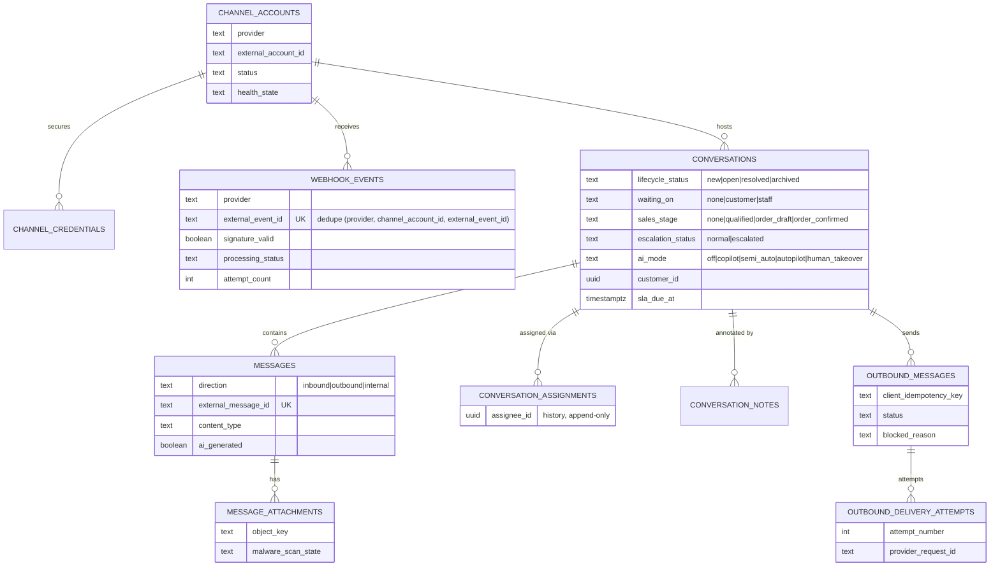
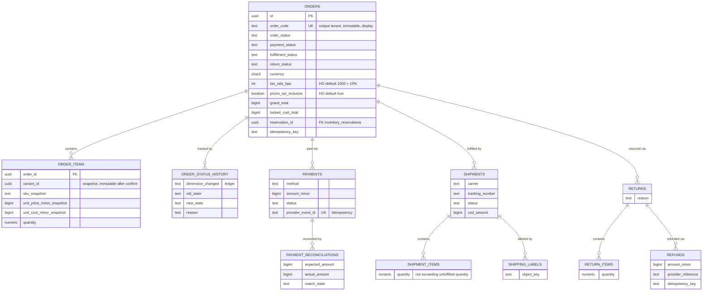
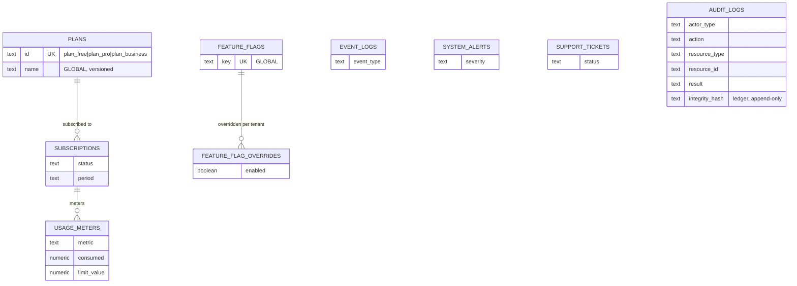

# ERD — Entity Relationship Diagrams (P1–P2 baseline)

Source of truth for field-level rules, constraints, and validation remains
`backend_doc/01_BACKEND_ENTERPRISE_IMPLEMENTATION_BLUEPRINT_v2.0.md` §6–§7. This file renders
that prose into diagrams + a queryable index (see [`data-dictionary.md`](data-dictionary.md)) so a
developer can see relationships at a glance instead of parsing paragraphs. **If this file and the
blueprint ever disagree, the blueprint wins — fix this file, don't fix the blueprint from here.**

**Enterprise freeze W4 (2026-07-22):** table classes + RLS intent are frozen in
[`data-dictionary.md`](data-dictionary.md) + [`rls-intent-catalog.md`](rls-intent-catalog.md)
(`Needs confirmation` = 0). Money/tax: [`../business/HO_DEFAULTS_v1.md`](../business/HO_DEFAULTS_v1.md).

Every table also carries the standard audit columns from blueprint §7.2
(`id, tenant_id, version, created_at, created_by, updated_at, updated_by, deleted_at?, metadata`)
unless noted `[ledger]` (append-only, no `updated_at`/`version` update after insert per §7.2) or
`[GLOBAL]` (no `tenant_id`, per §6.1). Diagrams omit these common columns for readability — full
column lists live in the blueprint sections cited under each diagram.

## How to keep this file honest

- Never add a field here that isn't in the cited blueprint section — if you need a new field,
  change the blueprint first (it's the contract), then mirror the diagram.
- When a module's real migration diverges from the blueprint (schema evolves during
  implementation), update **both** this file and the blueprint section in the same PR, or flag the
  drift in `contract-gap-board.md` if the two owners disagree on which is correct.

## 0. Foundation / P1 infrastructure (already migrated)

Not drawn as a full ERD — classes + RLS status live in the dictionary:

| Table | Class | Migration |
|-------|-------|-----------|
| `audit_events` | TENANT_OWNED | `000002` |
| `outbox_events` | TENANT_OWNED | `000002` + worker policy `000004` |
| `idempotency_records` | TENANT_OWNED | `000003` |
| `inbox_events` | TENANT_OWNED | `000004` |

Identity tables (§1) shipped in **`000005_identity_schema.sql`** (BE-IDN-001) — see data-dictionary RLS status **Done**.

`audit_events` (skeleton) must converge with domain `audit_logs` (§7.12.5) via expand/contract — see
[`rls-intent-catalog.md`](rls-intent-catalog.md).

---

## 1. Identity / Tenant (blueprint §7.5)

Notes: `TENANT_MEMBERSHIPS` unique `(tenant_id, user_id)`. `MEMBERSHIP_ROLES` tenant-consistent —
never assign a custom role from tenant A to a membership in tenant B. Full field list: §7.5.1–7.5.7.

## 2. Customer / CDP (blueprint §7.6)

Notes: unique identity is never on the encrypted field directly — always via
`customer_identities` + provider rules (§7.6.2). Address snapshot must be copied into the order at
confirm time (§7.6.3) — orders do not reference `customer_addresses` live after confirmation.

## 3. Catalog (blueprint §7.7)

Notes: `PRODUCTS` does not carry inventory quantity — that lives entirely in the Inventory context
below, linked only by `variant_id`. Import confirm requires job version/checksum match to prevent
a changed file/mapping being applied silently after preview (§7.7.6).

## 4. Inventory (blueprint §7.8)

Notes: `available_to_sell = max(0, on_hand - reserved - blocked - damaged - safety_stock)` — a
derived value, not a stored column (§7.8.2, invariant §4.3.4: never negative after commit).
Unique `(tenant_id, warehouse_id, variant_id)` on `inventory_balances`. Reservation items change
`reserved` only, never `on_hand` directly (§7.8.5).

## 5. Knowledge / AI (blueprint §7.9)

Notes: retrieval MUST filter tenant + published version only (§7.9.2, invariant §4.3.7). Active
`prompt_versions` row is immutable — editing creates a new version, never an in-place update.

## 6. Channel / Conversation (blueprint §7.10)

Notes: `conversations` deliberately splits state across 5 independent dimensions rather than one
status enum (§7.10.4) — do not collapse these into a single "conversation status" field anywhere
in FE or reporting. Webhook dedupe falls back to payload-hash + time bucket only when the provider
gives no event ID (§7.10.3).

## 7. Order / Payment / Fulfillment (blueprint §7.11)

Notes: a confirmed order's items are an immutable price/cost snapshot (invariant §4.3.5) — later
catalog changes never rewrite order history. Amendments after confirm go through an explicit P1
amendment flow, not a direct `order_items` update (§7.11.1). Prices are tax-**inclusive** at 10%
VAT unless an ADR supersedes [`HO_DEFAULTS_v1`](../business/HO_DEFAULTS_v1.md).

## 8. Analytics / Billing / Ops (blueprint §7.12)

Notes: `event_logs` is an immutable projection, not a replacement for the outbox (§7.12.1). Billing
enforcement never blocks critical recovery/support flows (§4.2). `audit_logs` never contains raw
secrets or full sensitive PII — only redacted before/after (§7.12.5). Over-limit: soft_warn →
hard_block (HO_DEFAULTS). Skeleton `audit_events` ↔ domain `audit_logs` convergence: see §0.

## Source-of-truth matrix (copied from blueprint §7.13 — do not fork, edit there)

| Dữ liệu | Source of truth | Derived/cache |
|---|---|---|
| Current stock | `inventory_balances` reconciled against ledger | cache/search |
| Stock history | `inventory_movements` | report fact |
| Order total | `orders` + `order_items` snapshot | dashboard fact |
| Current conversation state | `conversations` | inbox cache |
| Message content/delivery | `messages`, `outbound_messages` | search index |
| Permission | membership/role/permission tables | Redis permission cache |
| AI decision trace | `ai_logs`, `ai_tool_calls`, policy decision | dashboard fact |
| Revenue/profit report | facts reconciled with order/payment source | materialized views |
