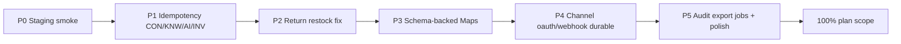

# Kế hoạch hoàn thiện phần còn lại → 100%

**Date:** 2026-07-23  
**Baseline:** Postgres adapters Exit checklist đã **100%** (plan `2026-07-22-postgres-adapters-priority.md`).  
**Mục tiêu tài liệu này:** đóng Gaps v1 + vận hành staging để đạt **~100% “hoàn thiện vận hành backend”** theo cùng phạm vi plan đó.

**Không nằm trong 100% này (để riêng / HO):** Desktop productization thật, Hardening pentest staging, KMS PII thật, FE sync — giữ stub/code-complete như thiết kế.

---

## Hiện trạng (baseline)

| Khối | % | Ghi chú |
|------|---|--------|
| Exit adapters + Identity + wire | 100% | PR #5–#11 |
| Ops health + reprocess Map + smoke script | ~95% | PR #12; chưa chạy staging |
| HTTP IdempotencyStore | ~70% | ORD/PAY/FUL/CUS/CAT/CHN xong |
| Gaps domain / schema phụ | ~35% | còn CON/KNW/AI/INV Maps, restock, uploads… |
| Staging migrate + smoke | 0% | thiếu `DATABASE_URL` |

**Ước lượng tổng “hoàn thiện plan”:** ~80% → mục tiêu kế hoạch này: **100%**.

---

## Nguyên tắc ưu tiên

1. **An toàn multi-instance trước** (IdempotencyStore / unique DB)  
2. **Đúng nghiệp vụ trước** (restock return, variant lookup)  
3. **Vận hành staging sớm** (chứng minh migrate + invite)  
4. **Schema mới chỉ khi Map không đủ** (upload, recon jobs, SSE)  
5. **Stub có chủ đích giữ nguyên** (desktop, hardening HO, Facebook adapter stub)

Mỗi bước = 1 PR nhỏ, mergeable, có verify: `pnpm typecheck` + vitest module liên quan.

---

## Lộ trình theo phase

---

## P0 — Staging: migrate + smoke invite/accept (P0, 0.5–1 ngày)

**Mục tiêu:** chứng minh DB thật chạy `000024`…`000027` + invite→accept.

| Bước | Việc | Ai / cách | Done khi |
|------|------|-----------|----------|
| P0.1 | Có `DATABASE_URL` staging (hoặc local Postgres) | Ops / bạn | env set được |
| P0.2 | `cd backend && SMOKE_MIGRATE=1 node tools/smoke-invite-accept.mjs` | Agent/bạn | helpers `invite_member`, `accept_invitation`, `ops_*` hiện diện |
| P0.3 | Full smoke với `SMOKE_TENANT_ID` / `SMOKE_ACTOR_ID` / `SMOKE_OWNER_ROLE_ID` | Agent/bạn | invite + accept outcome `ok` |
| P0.4 | Ghi evidence vào plan/ticket (log + commit SHA) | Agent | checklist staging ✅ |

**Blocker hiện tại:** máy agent không có Docker/`DATABASE_URL`.  
**Unblock:** bạn cung cấp URL hoặc chạy P0.2–P0.3 rồi gửi log.

**Không merge code mới** trừ khi phát hiện bug migration → hotfix PR.

---

## P1 — HTTP IdempotencyStore còn lại (P0/P1, 2–3 ngày)

Pattern copy: `order-idempotency.ts` / PR #13–#14.

### P1.a — Conversation (0.5–1 ngày)

| Bước | File / scope |
|------|----------------|
| 1 | `conversation-idempotency.ts` + wire create/assign/note/job APIs |
| 2 | Scopes: `conversation.create`, `conversation.assign`, `conversation.note`, `conversation.job.*` |
| 3 | Postgres: bỏ `idempotentConversations` / `idempotentJobs` |
| 4 | **Giữ** `sseEvents`, `customerStub` (chưa có bảng) |
| 5 | Wire `idempotency` trong controller + `app.module` |
| 6 | vitest conversation + typecheck |

### P1.b — Knowledge (0.5 ngày)

| Bước | File / scope |
|------|----------------|
| 1 | `knowledge-idempotency.ts` |
| 2 | Scopes: `knowledge.source.*`, `knowledge.version.*`, `knowledge.publish`, `knowledge.job.*` |
| 3 | Bỏ Maps `idempotentResources` / `idempotentJobs` trên postgres-knowledge |
| 4 | Wire + tests |

### P1.c — AI orchestration (0.5 ngày)

| Bước | File / scope |
|------|----------------|
| 1 | `ai-idempotency.ts` |
| 2 | Scopes: `ai.suggest`, `ai.tool`, `ai.eval`, … (theo API có Idempotency-Key) |
| 3 | Bỏ Map `idempotency` trên postgres-ai-orchestration |
| 4 | Wire + tests |
| 5 | (Optional cùng PR) unique index `ai_tool_calls(tenant_id, idempotency_key)` nếu column đã có |

### P1.d — Inventory (1 ngày)

| Bước | File / scope |
|------|----------------|
| 1 | `inventory-idempotency.ts` |
| 2 | Migrate Maps HTTP: warehouse / adjustment / reservation / reservationCommand → store |
| 3 | **Giữ** `reconciliationJobs` (+ idem Map) cho tới P3 (chưa có bảng job) **hoặc** migrate HTTP key sang store, job body vẫn Map |
| 4 | Wire inventory controller + `app.module` |
| 5 | vitest inventory |

**Exit P1:** không còn HTTP Idempotency-Key dựa process Map trên domain chính (trừ job/upload chưa có bảng).  
**Progress IdempotencyStore:** ~70% → **~100% HTTP path**.

---

## P2 — Đúng nghiệp vụ Returns / Inventory (P0 bug, 0.5–1 ngày)

| Bước | Việc | Chi tiết |
|------|------|----------|
| P2.1 | Lookup `order_item → variant_id` | Trong `completeReturn` / fulfillment app: load order item từ Order repo hoặc SQL join |
| P2.2 | Implement `InventoryRestockPort` thật | `app.module.ts`: gọi `PostgresInventoryRepository` adjust/restock thay no-op |
| P2.3 | Test | Unit: complete return → inventory tăng đúng variant; typecheck |
| P2.4 | Cập nhật Gaps plan | Xóa dòng restock/variant bug |

**PR:** `fix(backend): wire return restock + orderItem→variant lookup`

---

## P3 — Schema cho Maps “chưa có bảng” (P1, 2–3 ngày)

Chỉ làm khi cần durable multi-instance.

### P3.a — Media upload intents (1 ngày)

| Bước | Việc |
|------|------|
| 1 | Migration `000028_media_upload_intents.sql` (TENANT_OWNED RLS) |
| 2 | Persist từ Catalog `uploads` Map → table |
| 3 | Bỏ Map `uploads` trên postgres-catalog |
| 4 | Tests + Gaps update |

### P3.b — Inventory reconciliation jobs (1 ngày)

| Bước | Việc |
|------|------|
| 1 | Migration `000029_inventory_reconciliation_jobs.sql` |
| 2 | Persist `reconciliationJobs` |
| 3 | HTTP idempotency job qua store (nếu chưa ở P1.d) |
| 4 | Tests |

### P3.c — Conversation SSE buffer (optional, 1 ngày) — có thể **defer**

| Bước | Việc |
|------|------|
| 1 | Quyết định: Redis/pubsub vs table `conversation_sse_buffer` |
| 2 | Nếu table: migration + adapter; nếu Redis: ngoài scope DB plan → ghi “out of scope” và đóng gap bằng ADR |

**Khuyến nghị:** P3.c ghi ADR “SSE process-local OK cho v1” nếu chưa có Redis → **không chặn 100% plan DB**.

---

## P4 — Channel durable OAuth / webhook null-tenant (P1, 1–1.5 ngày)

| Bước | Việc |
|------|------|
| P4.1 | Persist OAuth `state → tenant` (bảng ephemeral hoặc reuse pattern OIDC state) |
| P4.2 | Webhook null-tenant dedupe: đảm bảo unique index + path DB (giảm `webhookDedupe` Map) |
| P4.3 | Giữ Map chỉ như L1 cache optional hoặc xóa hẳn |
| P4.4 | Tests channel connect/webhook replay |

**PR:** `feat(backend): durable channel OAuth state + webhook dedupe`

---

## P5 — Audit export durable + Gaps còn lại (P2, 1–2 ngày)

| Bước | Việc |
|------|------|
| P5.1 | Migration `000030_audit_export_jobs.sql` (hoặc sync-only ADR: “export sync đủ v1”) |
| P5.2 | Nếu table: `PostgresAuditLogStore.createExport` persist + `getExport` đọc DB; idempotency qua store |
| P5.3 | Payment `reconciliations` table: hoặc wire method tối thiểu, hoặc ADR “unused until BE-PAY-00x” |
| P5.4 | Import `file_key` / object storage: stub S3 key generator hoặc ADR nullable OK |
| P5.5 | Dọn Gaps section trong plan — mọi mục [x] hoặc “wontfix/ADR” |
| P5.6 | Checklist 100%: typecheck full + vitest modules chính + staging smoke P0 lại |

---

## Thứ tự PR đề xuất (merge tuần tự)

| # | PR | Phase | Effort | Phụ thuộc |
|---|----|-------|--------|-----------|
| 1 | *(ops)* Staging migrate evidence | P0 | 0.5d | `DATABASE_URL` |
| 2 | Conversation → IdempotencyStore | P1.a | 0.5–1d | — |
| 3 | Knowledge + AI → IdempotencyStore | P1.b+c | 1d | — |
| 4 | Inventory → IdempotencyStore | P1.d | 1d | — |
| 5 | Return restock + variant lookup | P2 | 0.5–1d | INV adapter |
| 6 | Media upload table `000028` | P3.a | 1d | — |
| 7 | Recon jobs table `000029` | P3.b | 1d | — |
| 8 | Channel OAuth/webhook durable | P4 | 1–1.5d | — |
| 9 | Audit export jobs / ADR Gaps đóng | P5 | 1–2d | — |

**Tổng effort ước lượng:** ~7–11 ngày làm việc agent+review (không kể chờ staging credentials).

---

## Định nghĩa “100%” (acceptance)

- [ ] Staging: migrate `000024+` applied + smoke invite/accept OK (evidence)  
- [ ] HTTP Idempotency-Key: CON, KNW, AI, INV dùng `PostgresIdempotencyStore` (không Map)  
- [ ] `InventoryRestockPort` không còn no-op; return complete dùng đúng `variant_id`  
- [ ] Gaps trong plan: mỗi dòng ✅ hoặc ADR wontfix rõ ràng  
- [ ] `pnpm typecheck` + vitest modules chính xanh  
- [ ] Desktop / hardening / KMS / FE: **ngoài scope** (ghi rõ trong plan)

---

## Việc làm ngay (bước 1)

**Hai lựa chọn song song:**

1. **Bạn:** cung cấp `DATABASE_URL` (hoặc chạy P0 và gửi log) → đóng staging.  
2. **Agent:** bắt đầu **P1.a Conversation IdempotencyStore** (không cần DB) ngay trên branch mới.

Khuyến nghị: **P1.a trước** nếu chưa có staging URL trong 24h; chen **P0** ngay khi có credentials.

---

## Liên kết

- Plan gốc: [`2026-07-22-postgres-adapters-priority.md`](./2026-07-22-postgres-adapters-priority.md)  
- Smoke: `backend/tools/smoke-invite-accept.mjs`  
- Pattern: `modules/order/src/application/order-idempotency.ts`
