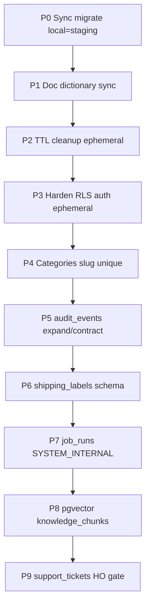

# DB Schema Completion — Implementation Plan

> **For agentic workers:** REQUIRED SUB-SKILL: Use `superpowers:subagent-driven-development` (recommended) or `superpowers:executing-plans` to implement this plan task-by-task. Steps use checkbox (`- [ ]`) syntax for tracking.

**Date:** 2026-07-24  
**Baseline:** Live local `app.*` = **98** tables; dictionary **Not started** = 4; doc drift ≈ 11 tables already migrated; local migrations **33** vs staging **34**.  
**Goal:** Đóng gap schema/docs/ops cho DB enterprise — sync → docs → TTL/harden → ledger audit → bảng còn thiếu theo feature gate — **không** redesign schema đang chạy.

**Architecture:** Một chuỗi migration bất biến (`infra/migrations/000NNN_*.sql`) + cập nhật `docs/data/*` + (khi cần) worker/scheduler cleanup. RLS theo `rls-intent-catalog.md`. Audit chỉ **expand/contract** `audit_events` → `audit_logs` (cấm bảng audit thứ 3). Vector/pgvector và `shipping_labels` / `support_tickets` / `job_runs` chỉ khi feature/HO gate mở.

**Tech Stack:** PostgreSQL 17, `pg` + Kysely (`@ai-sales/database`), Nest API/worker/scheduler, Supabase staging pooler, `pnpm migrate` (`tools/migrate.mjs`).

## Global Constraints

- Blueprint + ADRs thắng mọi shortcut; không tin `tenant_id` từ client.
- Migration **immutable** — chỉ thêm file mới, không sửa SQL đã apply shared env.
- TENANT_OWNED: `tenant_id NOT NULL`, ENABLE+FORCE RLS, composite tenant FK khi quan hệ cross-table.
- Ledger: không hard-DELETE; money = `bigint` minor units.
- Secrets chỉ `.env.local` / `.env.staging` / secret store — không commit/chat.
- Mỗi task xong: `pnpm typecheck` (nếu đụng TS) + migrate local; staging migrate chỉ sau khi local green.
- Cap cloud / HO gates: không tự nâng Supabase Pro chỉ để bật extension nếu free plan không đủ — ghi evidence và dừng đúng gate.

---

## File map (toàn plan)

| Path | Responsibility |
|------|----------------|
| `backend/infra/migrations/000035_*.sql` … | Schema/RLS/TTL indexes mới |
| `backend/docs/data/data-dictionary.md` | Class + RLS status canonical |
| `backend/docs/data/ERD.md` | Field/relationship mirror |
| `backend/docs/data/rls-intent-catalog.md` | Policy templates |
| `backend/modules/audit/.../postgres-audit-log-store.ts` | Đọc/ghi ledger audit |
| `backend/apps/worker/src/` hoặc `packages/` cleanup | TTL ephemeral purge |
| `backend/apps/scheduler/src/main.ts` | Đăng ký job maintenance TTL |
| `backend/packages/database/src/index.ts` | Kysely types nếu đổi tên bảng |



**Thứ tự bắt buộc:** P0→P5. **P6–P9** có gate (xem từng phase) — làm tuần tự khi gate mở, không song song phá dependency.

---

## Phase P0 — Sync migration local ↔ staging (0.5 ngày)

**Mục tiêu:** Local và staging cùng số version; không lệch schema trước mọi thay đổi mới.

### Task P0.1 — Apply pending trên local

**Files:** không sửa code; chạy migrate.

- [ ] **Step 1:** Từ `backend/`, nạp `DATABASE_URL` từ `.env.local` (PowerShell):

```powershell
Get-Content .env.local | ForEach-Object {
  if ($_ -match '^\s*([^#][^=]+)=(.*)$') { Set-Item -Path "env:$($matches[1])" -Value $matches[2] }
}
pnpm migrate
```

Expected: apply mọi file pending (ít nhất `000034_fix_accept_invitation_ambiguity.sql` nếu chưa có) hoặc `No pending migrations.`

- [ ] **Step 2:** Đếm version local:

```powershell
# Dùng psql hoặc node one-liner — expected count = số file 000NNN trong infra/migrations
node -e "import('fs').then(async fs=>{const n=(await fs.promises.readdir('infra/migrations')).filter(f=>/^\\d{6}_.+\\.sql$/i.test(f)).length; console.log('files',n)})"
```

- [ ] **Step 3:** So staging (từ `.env.staging`, **không** in password):

```powershell
# Chỉ chạy khi đã có .env.staging; expected migrations count == local files count
$env:DATABASE_URL = (Get-Content .env.staging | ? { $_ -match '^DATABASE_URL=' }) -replace '^DATABASE_URL=',''
node -e "import pg from 'pg'; import {readFileSync} from 'fs'; const u=process.env.DATABASE_URL; const c=new pg.Client({connectionString:u}); await c.connect(); const r=await c.query('select count(*)::int as n from app.schema_migrations'); console.log(r.rows[0]); await c.end();"
```

Expected: `n` bằng số file migration trong repo.

- [ ] **Step 4:** Ghi 1 dòng evidence vào `backend/docs/release/HO-STAGING-CHECKLIST.md` (hoặc ticket BE-FND-015) — “local migrations = staging = N” + ngày; **không** dán URL/password.

**Done khi:** local apply xong; count local == staging == số file SQL.

**Không commit** trừ khi phát hiện migration hỏng → hotfix PR riêng trước P1.

---

## Phase P1 — Đồng bộ data-dictionary / ERD (doc-only, 0.5 ngày)

**Mục tiêu:** Agent không tạo trùng bảng đã migrate.

### Task P1.1 — Thêm hàng dictionary cho bảng đã có

**Files:**
- Modify: `backend/docs/data/data-dictionary.md`
- Modify: `backend/docs/data/ERD.md` (chỉ note / dòng status nếu cần)
- Modify: `backend/docs/data/rls-intent-catalog.md` nếu thiếu template pointer

Bảng tối thiểu phải có hàng **Done** (class đúng):

| Table | Class | Migration |
|-------|-------|-----------|
| `oidc_login_states` | SYSTEM_INTERNAL / ephemeral | `000006` |
| `password_reset_tokens` | GLOBAL (user-scoped) | `000009` |
| `mfa_challenges` | GLOBAL (user-scoped) | `000009` |
| `channel_oauth_states` | TENANT_OWNED | `000017` |
| `payment_attempts` | TENANT_OWNED | `000020` |
| `projection_watermarks` | TENANT_OWNED | `000022` |
| `report_exports` | TENANT_OWNED | `000022` |
| `ai_suggestions` | TENANT_OWNED | `000024` |
| `tenant_ai_controls` | TENANT_OWNED | `000024` |
| `media_upload_intents` | TENANT_OWNED | `000028` |
| `inventory_reconciliation_jobs` | TENANT_OWNED | `000029` |

- [ ] **Step 1:** Mở `data-dictionary.md`, chèn hàng vào section phù hợp; cập nhật summary counts ở cuối file (Total indexed / RLS done).
- [ ] **Step 2:** Trong ERD §0 hoặc note liên quan: liệt kê “also migrated” nếu diagram chưa vẽ.
- [ ] **Step 3:** Self-check — grep repo không còn “Not started” cho các tên trên.

```powershell
Select-String -Path docs/data/data-dictionary.md -Pattern "media_upload_intents|ai_suggestions|payment_attempts"
```

Expected: match + status Done.

- [ ] **Step 4:** Commit (khi user yêu cầu commit):

```bash
git add backend/docs/data/data-dictionary.md backend/docs/data/ERD.md backend/docs/data/rls-intent-catalog.md
git commit -m "docs(data): sync dictionary for migrated tables missing from index"
```

**Done khi:** 11 bảng drift có hàng Done; summary counts khớp thực tế.

---

## Phase P2 — TTL cleanup bảng ephemeral (1–1.5 ngày)

**Mục tiêu:** Không phình DB từ OIDC state / upload intent / reset / MFA / idempotency hết hạn.

### Task P2.1 — Indexes hỗ trợ delete theo `expires_at` (nếu thiếu)

**Files:**
- Create: `backend/infra/migrations/000035_ephemeral_ttl_indexes.sql`

- [ ] **Step 1:** Kiểm tra index hiện có:

```sql
SELECT tablename, indexname FROM pg_indexes
WHERE schemaname = 'app'
  AND tablename IN (
    'oidc_login_states','media_upload_intents',
    'password_reset_tokens','mfa_challenges','idempotency_records'
  )
ORDER BY 1,2;
```

- [ ] **Step 2:** Chỉ tạo index còn thiếu, ví dụ:

```sql
-- 000035_ephemeral_ttl_indexes.sql
CREATE INDEX IF NOT EXISTS idx_password_reset_tokens_expires
  ON app.password_reset_tokens (expires_at)
  WHERE consumed_at IS NULL;  -- điều chỉnh theo cột thật trong 000009

CREATE INDEX IF NOT EXISTS idx_mfa_challenges_expires
  ON app.mfa_challenges (expires_at);

-- oidc / media / idempotency: giữ IF NOT EXISTS; bỏ qua nếu đã có từ 000003/000006/000028
```

- [ ] **Step 3:** `pnpm migrate` local; confirm index tồn tại.
- [ ] **Step 4:** Commit migration khi user yêu cầu.

### Task P2.2 — Purge function + worker tick

**Files:**
- Create: `backend/infra/migrations/000036_ephemeral_ttl_purge_fn.sql` (optional SECURITY DEFINER `app.purge_ephemeral_rows()` chạy bằng `app_worker`)
- Modify: `backend/apps/worker/src/main.ts` **hoặc** processor mới dưới `apps/worker/src/` gọi purge mỗi N phút
- Modify: `backend/apps/scheduler/src/main.ts` — thêm scheduler id `maintenance-ephemeral-ttl` vào queue `maintenance.reconcile` (hoặc queue riêng `maintenance.purge` nếu đã có trong blueprint §9.6)

**Semantics đề xuất (chốt trong migration comment):**

| Table | Delete when |
|-------|-------------|
| `oidc_login_states` | `expires_at < now()` |
| `media_upload_intents` | `expires_at < now()` AND (`bytes_received = false` OR older than 7d) |
| `password_reset_tokens` | expired hoặc consumed + age > 7d |
| `mfa_challenges` | `expires_at < now()` |
| `idempotency_records` | `expires_at < now()` |

- [ ] **Step 1:** Viết test unit/integration (vitest) mock DB hoặc live `DATABASE_URL`: insert 1 row expired → gọi purge → row count 0.
- [ ] **Step 2:** Implement purge (SQL function **hoặc** Kysely deletes trong worker với role `app_worker`).
- [ ] **Step 3:** Wire scheduler upsertJobScheduler every 5–15 phút; worker xử lý job.
- [ ] **Step 4:** Chạy test; `pnpm typecheck`.
- [ ] **Step 5:** Migrate staging **sau** local green (`DATABASE_URL` từ `.env.staging` — không log URL).

**Done khi:** expired row bị xóa trong test; scheduler đăng ký không lỗi khi có `REDIS_URL`.

---

## Phase P3 — Harden RLS / grants auth ephemeral (1 ngày)

**Mục tiêu:** `mfa_challenges`, `password_reset_tokens`, `oidc_login_states` không phụ thuộc “may mắn grants”.

### Task P3.1 — Deny-default + SECURITY DEFINER only path

**Files:**
- Create: `backend/infra/migrations/000037_harden_auth_ephemeral_rls.sql`
- Review: functions trong `000006`, `000009`, `000032`–`000034` (OIDC / MFA)

- [ ] **Step 1:** Đọc grants hiện tại:

```sql
SELECT grantee, privilege_type
FROM information_schema.role_table_grants
WHERE table_schema='app'
  AND table_name IN ('oidc_login_states','password_reset_tokens','mfa_challenges');
```

- [ ] **Step 2:** Migration pattern:
  - `ENABLE ROW LEVEL SECURITY` + `FORCE`
  - Policy deny-all cho `app_runtime` **trừ** nếu đã có policy actor-based an toàn
  - Giữ đường đi qua `SECURITY DEFINER` functions (REVOKE table từ PUBLIC; GRANT EXECUTE function cho `app_runtime`)
- [ ] **Step 3:** Integration test: gọi API/helper password-reset / MFA / OIDC state save+consume vẫn PASS; direct `SELECT` với `app_runtime` + empty `app.tenant_id` → 0 rows.
- [ ] **Step 4:** Migrate local → staging.

**Done khi:** smoke auth path không gãy; direct table read bị chặn.

---

## Phase P4 — Categories slug uniqueness (0.5 ngày + HO quyết định)

**Gate:** Human Owner chọn **một**:
- **A)** unique `(tenant_id, parent_id, slug)` (null parent = root), hoặc  
- **B)** unique `(tenant_id, slug)` toàn tenant.

### Task P4.1 — Migration + dictionary note

**Files:**
- Create: `backend/infra/migrations/000038_categories_slug_unique.sql`
- Modify: `backend/docs/data/data-dictionary.md` (bỏ “open product decision”)
- Modify: `backend/docs/business/` hoặc ticket BE-CAT-* ghi quyết định HO

- [ ] **Step 1:** Ghi quyết định A hoặc B vào ticket/ADR ngắn (1 đoạn).
- [ ] **Step 2:** Trước unique index — query duplicate:

```sql
-- Ví dụ scope B:
SELECT tenant_id, slug, count(*) FROM app.categories GROUP BY 1,2 HAVING count(*) > 1;
```

Nếu có duplicate: sửa data (script one-off) **trước** unique index.

- [ ] **Step 3:** `CREATE UNIQUE INDEX ...` theo scope đã chọn (partial unique cho `parent_id IS NULL` nếu A).
- [ ] **Step 4:** Test catalog create category trùng slug → conflict error ổn định.
- [ ] **Step 5:** Update dictionary Notes.

**Done khi:** unique enforced; dictionary không còn “open product decision”.

**Nếu HO chưa chọn:** dừng phase; đánh dấu Blocked-HO; tiếp P5.

---

## Phase P5 — Expand/contract `audit_events` → `audit_logs` (2–3 ngày)

**Mục tiêu:** Một ledger domain đúng §7.12.5; store API không đổi hành vi list/export.

### Task P5.1 — Expand: tạo `audit_logs` + backfill + dual-write

**Files:**
- Create: `backend/infra/migrations/000039_audit_logs_expand.sql`
- Modify: `backend/modules/audit/src/infrastructure/persistence/postgres-audit-log-store.ts`
- Modify: `backend/packages/database/src/index.ts` (types `AuditEventsTable` → thêm `audit_logs` hoặc alias)
- Modify: `backend/docs/data/data-dictionary.md` — `audit_logs` Done; note skeleton deprecated
- Test: `backend/modules/audit/src/infrastructure/persistence/postgres-audit-log-store.test.ts`

**Cột tối thiểu (align ERD + store hiện tại):**

```sql
CREATE TABLE app.audit_logs (
  id UUID PRIMARY KEY,
  tenant_id UUID NULL,  -- nullable-tenant class
  action TEXT NOT NULL,
  actor_id UUID NULL,
  correlation_id TEXT NOT NULL DEFAULT '',
  resource_type TEXT NULL,
  resource_id UUID NULL,
  payload JSONB NOT NULL DEFAULT '{}'::jsonb,  -- redacted only
  integrity_hash TEXT NULL,
  created_at TIMESTAMPTZ NOT NULL DEFAULT now()
);
-- RLS nullable-tenant template; FORCE; SELECT/INSERT only grants (ledger)
-- Backfill: INSERT INTO audit_logs SELECT ... FROM audit_events
-- Trigger hoặc dual-write app: insert cả hai trong cùng transaction tạm thời
```

- [ ] **Step 1:** Migration expand + backfill + RLS + grants ledger (no UPDATE/DELETE to `app_runtime`).
- [ ] **Step 2:** Đổi store: **dual-write** `audit_events` + `audit_logs`; **read** ưu tiên `audit_logs` (fallback events nếu trống — chỉ trong cửa sổ expand).
- [ ] **Step 3:** Tests list/export vẫn pass với `DATABASE_URL`.
- [ ] **Step 4:** Migrate staging; smoke `GET` audit logs API.

### Task P5.2 — Contract: bỏ dual-write, deprecate `audit_events`

**Files:**
- Create: `backend/infra/migrations/000040_audit_logs_contract.sql` (rename/view hoặc stop writes; **không DROP** ngay nếu còn retention — ưu tiên `CREATE VIEW app.audit_events AS SELECT ... FROM audit_logs` + stop inserts vào bảng cũ)
- Modify: store chỉ ghi `audit_logs`
- Modify: walking-skeleton tests trỏ `audit_logs` hoặc view

- [ ] **Step 1:** Chỉ chạy contract sau ≥1 deploy staging ổn định dual-write.
- [ ] **Step 2:** View tương thích hoặc drop write path cũ.
- [ ] **Step 3:** Dictionary: `audit_events` = compatibility view / retired; `audit_logs` = Done.
- [ ] **Step 4:** `pnpm test` module audit + `pnpm typecheck`.

**Done khi:** mọi write/read production path dùng `audit_logs`; không còn bảng audit thứ 3.

---

## Phase P6 — `shipping_labels` (1 ngày) — **gate: fulfillment carrier**

**Gate:** Chỉ khi ticket BE-FUL-* / carrier adapter bắt đầu cần `object_key` label.

### Task P6.1 — Schema + composite FK

**Files:**
- Create: `backend/infra/migrations/000041_shipping_labels.sql`
- Modify: `data-dictionary.md` → Done
- Optional later: `modules/fulfillment/...` repository — **có thể để stub** nếu API chưa sẵn

```sql
CREATE TABLE app.shipping_labels (
  id UUID PRIMARY KEY,
  tenant_id UUID NOT NULL,
  shipment_id UUID NOT NULL,
  object_key TEXT NOT NULL CHECK (char_length(btrim(object_key)) > 0),
  format TEXT NULL,           -- pdf|zpl|...
  created_at TIMESTAMPTZ NOT NULL DEFAULT now(),
  CONSTRAINT shipping_labels_shipment_fk
    FOREIGN KEY (shipment_id, tenant_id)
    REFERENCES app.shipments (id, tenant_id)
);
-- unique (id, tenant_id); RLS TENANT_OWNED template A; GRANT SELECT/INSERT
```

- [ ] **Step 1:** Migration + RLS isolation test.
- [ ] **Step 2:** Dictionary Done.
- [ ] **Step 3:** Không wire HTTP trừ khi OpenAPI đã có operation — contract-first.

**Done khi:** bảng + RLS + test isolation; API chỉ khi contract có.

---

## Phase P7 — `job_runs` SYSTEM_INTERNAL (1–1.5 ngày) — **gate: ops observability**

### Task P7.1 — Bảng + worker ghi run

**Files:**
- Create: `backend/infra/migrations/000042_job_runs.sql`
- Modify: worker outbox / queue processors ghi start/finish/error
- Dictionary: SYSTEM_INTERNAL Done
- **Không** expose user API (§6.1)

```sql
CREATE TABLE app.job_runs (
  id UUID PRIMARY KEY,
  job_name TEXT NOT NULL,
  queue_name TEXT NOT NULL,
  status TEXT NOT NULL CHECK (status IN ('running','succeeded','failed')),
  started_at TIMESTAMPTZ NOT NULL DEFAULT now(),
  finished_at TIMESTAMPTZ NULL,
  error_redacted TEXT NULL,
  metadata JSONB NOT NULL DEFAULT '{}'::jsonb
);
-- No tenant_id; RLS deny-default hoặc revoke từ app_runtime; GRANT INSERT/UPDATE cho app_worker only
CREATE INDEX idx_job_runs_name_started ON app.job_runs (job_name, started_at DESC);
```

- [ ] **Step 1:** Migration + grants worker-only.
- [ ] **Step 2:** Instrument 1 processor (outbox publish) ghi run.
- [ ] **Step 3:** Test insert + list by worker role.

**Done khi:** ít nhất 1 job path ghi `job_runs`; runtime role không SELECT được.

---

## Phase P8 — pgvector cho `knowledge_chunks` (2 ngày) — **gate: AI retrieval thật**

**Gate:** Khi bỏ `embedding_stub` và retrieval không còn keyword-only.

### Task P8.1 — Extension + column + index

**Files:**
- Create: `backend/infra/migrations/000043_knowledge_chunks_vector.sql`
- Modify: knowledge ingest / search application
- ADR ngắn nếu chọn chiều embedding (ví dụ 1536) — **không** hardcode model trong SQL comment mơ hồ

```sql
CREATE EXTENSION IF NOT EXISTS vector;  -- xác nhận Supabase plan cho phép; nếu không → Blocked-HO
ALTER TABLE app.knowledge_chunks
  ADD COLUMN IF NOT EXISTS embedding vector(1536);  -- chiều theo ADR
CREATE INDEX IF NOT EXISTS idx_knowledge_chunks_embedding_hnsw
  ON app.knowledge_chunks USING hnsw (embedding vector_cosine_ops)
  WHERE embedding IS NOT NULL;
-- Giữ filter bắt buộc tenant_id + published version trong mọi query (§4.3.7)
```

- [ ] **Step 1:** Confirm extension trên staging (`CREATE EXTENSION` trong migration hoặc dashboard).
- [ ] **Step 2:** Migration + backfill path (nullable embedding trong lúc ingest lại).
- [ ] **Step 3:** Search query luôn `WHERE tenant_id = ... AND version_id IN (published...)`.
- [ ] **Step 4:** Tenant isolation test vector search (cross-tenant 0 hits).

**Done khi:** extension ok; isolation test pass; stub JSONB có thể deprecate dần (expand/contract riêng nếu cần).

---

## Phase P9 — `support_tickets` (optional) — **gate: HO**

**Gate:** HO xác nhận support **in-app** (không Zendesk/Linear ngoài).

### Task P9.1 — Schema tối thiểu hoặc skip

- [ ] **Step 1:** Nếu HO = **dùng tool ngoài** → đánh dấu dictionary `Deferred` / bỏ Not started; **không** migrate.
- [ ] **Step 2:** Nếu HO = **in-app** → migration `000044_support_tickets.sql` TENANT_OWNED + RLS + OpenAPI trước code.
- [ ] **Step 3:** Update dictionary.

**Done khi:** hoặc Deferred có chữ HO, hoặc bảng + contract Done.

---

## Verification matrix (mỗi phase)

| Check | Lệnh / bằng chứng |
|-------|-------------------|
| Migrate local | `pnpm migrate` exit 0 |
| Types | `pnpm typecheck` nếu đụng TS |
| Module tests | `pnpm exec vitest run modules/<area>` |
| Staging migrate | cùng `migrate.mjs` với `.env.staging` sau local |
| RLS | integration test tenant A không đọc tenant B |
| Docs | dictionary status khớp live `\dt app.*` |

---

## Out of scope (cố ý)

- Redesign multi-schema per tenant / sharding
- Index speculative trên bảng gần như rỗng
- Production go-live / pentest vendor
- FE sync cho bảng mới trừ khi contract đã freeze

---

## Self-review (plan)

| Spec item (từ review DB) | Task |
|--------------------------|------|
| Sync migrate 33↔34 | P0 |
| Doc drift 11 bảng | P1 |
| TTL ephemeral | P2 |
| RLS auth ephemeral | P3 |
| Categories slug | P4 |
| audit_logs converge | P5 |
| shipping_labels | P6 |
| job_runs | P7 |
| pgvector | P8 |
| support_tickets | P9 |
| Không invent bảng thừa | Global Constraints + Out of scope |

Không có TBD/placeholder trong bước thực thi; gate HO được gọi tên rõ.

---

## Ước lượng

| Phase | Effort | Blocker |
|-------|--------|---------|
| P0 | 0.5d | `.env.local` / staging URL |
| P1 | 0.5d | — |
| P2 | 1–1.5d | Redis nếu dùng scheduler |
| P3 | 1d | Không làm gãy OIDC smoke |
| P4 | 0.5d | **HO** A vs B |
| P5 | 2–3d | Dual-write window |
| P6 | 1d | Carrier ticket |
| P7 | 1–1.5d | Ops priority |
| P8 | 2d | Extension / model ADR |
| P9 | 0–1d | **HO** in-app vs external |

**Critical path hoàn thiện “schema hygiene”:** P0 → P1 → P2 → P3 → P5 (~5–7 ngày).  
**Feature tables:** P4/P6/P7/P8/P9 theo gate.
