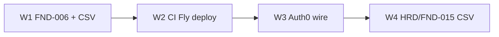

# DOC_GATE Code-complete → 100% (scope C) — Implementation Plan

> **For agentic workers:** REQUIRED SUB-SKILL: Use `superpowers:subagent-driven-development` (recommended) or `superpowers:executing-plans` to implement this plan task-by-task. Steps use checkbox (`- [ ]`) syntax for tracking.

**Goal:** Đưa backlog DOC_GATE lên 157/157 Done và hoàn thiện staging còn lại (CSV hygiene, FND-006, CI→Fly optional, Auth0) theo design đã duyệt — không authorize production go-live.

**Architecture:** Bốn wave tuần tự. W1 đóng foundation + sync CSV. W2 mở rộng `staging-preflight` deploy (skip nếu thiếu token). W3 HO tạo Auth0 rồi agent wire + smoke. W4 đồng bộ ticket/CSV Blocked-HO với HO-GATES và cập nhật ledger.

**Tech Stack:** pnpm monorepo backend, GitHub Actions, Fly.io, Auth0 Free, Supabase Free, Node 24.18 / pnpm 11.9.

**Spec:** [`../specs/2026-07-24-doc-gate-code-complete-design.md`](../specs/2026-07-24-doc-gate-code-complete-design.md)

## Global Constraints

- Never commit or chat secrets (`.env.staging`, `.auth0-staging.env`, GH/Fly tokens).
- Cloud spend cap ~$25/mo — no unsolicited Supabase Pro / paid pentest.
- No production go-live; `BE-HRD-010` Done means readiness review only.
- Fly API app name: `phan-mem-ban-hang-online-api` (not legacy `ai-sales-api-staging`).
- Do not create git commits unless Human Owner explicitly asks.
- Verify from `backend/` unless noted.

## File map

| Path | Responsibility |
|------|----------------|
| `backend/packages/database/src/index.ts` | Pool, statement_timeout, withTenantTransaction (FND-006) |
| `backend/docs/tickets/BE-FND-006.md` | Ticket status + completion manifest |
| `backend/docs/tickets/BE-FND-014.md` | Already Done — keep aligned |
| `backend/docs/tickets/BE-FND-015.md` | Staging Done + notes |
| `backend/docs/tickets/BE-HRD-001.md` … `010.md` | Status Done + waiver/go-live notes |
| `backend/backend_doc/matrices/implementation_backlog.csv` | Canonical backlog status |
| `backend/docs/enterprise-freeze/inventory/backlog_coverage.csv` | Mirror status |
| `.github/workflows/staging-preflight.yml` | migrate/health + optional Fly deploy |
| `backend/docs/release/BE-FND-014-staging-ci.md` | CI runbook |
| `backend/docs/release/staging-fly-deploy.md` | Manual/CI deploy URLs |
| `backend/docs/release/HARDENING-H5-EVIDENCE.md` | Refresh URLs if needed |
| `backend/tools/wire-auth0-staging.mjs` | Auth0 → `.env.staging` + correct Fly app hint |
| `backend/docs/release/HARDENING-H1-AUTH0.md` | HO console steps |
| `backend/docs/release/A-TO-F-EXECUTION-STATUS.md` | Live URLs + Auth0 status |
| `backend/docs/collaboration/OUTBOX.md` | Smoke evidence (no secrets) |
| `.superpowers/sdd/autonomous-progress.md` | Tier A/B ceiling ledger |



---

## Wave 1 — Close FND-006 + sync FND-014 CSV

### Task 1: Audit BE-FND-006 against backlog deliverable

**Files:**
- Read: `backend/packages/database/src/index.ts`
- Read: `backend/packages/database/src/with-tenant-transaction.test.ts`
- Read: `backend/docs/tickets/BE-FND-006.md`
- Read: `backend/backend_doc/matrices/implementation_backlog.csv` (row `BE-FND-006`)

**Done when:** Written gap list is empty OR Task 2 implements the only missing pieces. Expected deliverable from backlog: Kysely/pg pool, transaction runner, statement timeout — already present as `createDatabase` (`statement_timeout: 10_000`) and `withTenantTransaction`.

- [ ] **Step 1:** Confirm exports exist

Run from `backend/`:

```powershell
Select-String -Path packages/database/src/index.ts -Pattern "createDatabase|statement_timeout|withTenantTransaction|assertTenantSecurityContext"
```

Expected: matches for all four.

- [ ] **Step 2:** Run unit tests (no DB required for `with-tenant-transaction.test.ts`)

```powershell
cd backend
pnpm --filter @ai-sales/database exec vitest run src/with-tenant-transaction.test.ts src/migration-files.test.ts
```

Expected: PASS (or note any real failure as a gap for Task 2).

- [ ] **Step 3:** If no code gaps, skip Task 2 and go to Task 3. If a gap exists (e.g. missing timeout config docs in ticket only), list it in one bullet in the ticket Completion manifest under Known risks / Tests.

---

### Task 2: Fix any FND-006 code gap (only if Task 1 found one)

**Files:**
- Modify: `backend/packages/database/src/index.ts` (only if needed)
- Modify/Create test under `backend/packages/database/src/`

**Skip entirely if Task 1 found no code gap.**

- [ ] **Step 1:** Write the smallest failing test for the missing behavior
- [ ] **Step 2:** Run test — expect FAIL
- [ ] **Step 3:** Implement minimal fix
- [ ] **Step 4:** Run test — expect PASS
- [ ] **Step 5:** Re-run Task 1 Step 2 commands — expect PASS

---

### Task 3: Mark BE-FND-006 Done + sync both CSVs for FND-006 and FND-014

**Files:**
- Modify: `backend/docs/tickets/BE-FND-006.md`
- Modify: `backend/backend_doc/matrices/implementation_backlog.csv`
- Modify: `backend/docs/enterprise-freeze/inventory/backlog_coverage.csv`
- Modify: `.superpowers/sdd/autonomous-progress.md` (W1 note)

- [ ] **Step 1:** In `BE-FND-006.md`, set frontmatter `status: Done`. Fill Completion manifest:

```markdown
# Completion manifest

- Contracts changed: none
- Migration: none (package only)
- Tests/evidence: `pnpm --filter @ai-sales/database exec vitest run src/with-tenant-transaction.test.ts src/migration-files.test.ts` PASS; deliverable = createDatabase + statement_timeout 10s + withTenantTransaction
- Known risks: none for package surface; live RLS suites still skip without DATABASE_URL
```

Tick acceptance criteria that apply (happy path deliverable, tenant context assertion); mark N/A with note for OpenAPI/idempotency items that do not apply to a library package.

- [ ] **Step 2:** In `implementation_backlog.csv`, set status column to `Done` for `BE-FND-006` and `BE-FND-014` (FND-014 ticket already Done with H5 evidence).

- [ ] **Step 3:** In `backlog_coverage.csv`, set `backlog_status` to `Done` for the same two task_ids.

- [ ] **Step 4:** Verify counts

```powershell
cd backend
node -e "const fs=require('fs');const t=fs.readFileSync('backend_doc/matrices/implementation_backlog.csv','utf8');const rows=t.trim().split(/\r?\n/).slice(1).filter(Boolean);const c={};for(const r of rows){const s=r.split(',')[4];c[s]=(c[s]||0)+1;} console.log(c);"
```

Expected after W1: `Done` ≥ 152, `In Progress` = 0, `Blocked-HO` = 5.

- [ ] **Step 5:** Append one line to `.superpowers/sdd/autonomous-progress.md`: `W1 PASS — FND-006/014 CSV Done (date)`.

**Wave 1 exit:** In Progress = 0 on CSV.

---

## Wave 2 — Staging CI optional Fly deploy + URL refresh

### Task 4: Refresh staging CI/deploy docs to new Fly names

**Files:**
- Modify: `backend/docs/release/BE-FND-014-staging-ci.md`
- Modify: `backend/docs/release/staging-fly-deploy.md`
- Modify: `backend/docs/release/HARDENING-H5-EVIDENCE.md` (add note that API host is now `phan-mem-ban-hang-online-api.fly.dev`; keep historical run URL)

- [ ] **Step 1:** Replace source-of-truth mentions of `ai-sales-api-staging` / `ai-sales-*-staging` with `phan-mem-ban-hang-online-api` (and sibling web/ops/oidc names) in the three files above. Keep a one-line “legacy destroyed” note where helpful.

- [ ] **Step 2:** In `BE-FND-014-staging-ci.md`, document optional secret `FLY_API_TOKEN` and that deploy job skips when absent.

- [ ] **Step 3:** Grep check

```powershell
cd backend
Select-String -Path docs/release/BE-FND-014-staging-ci.md,docs/release/staging-fly-deploy.md -Pattern "ai-sales-api-staging" 
```

Expected: no remaining *instructional* uses (historical evidence lines OK if labeled historical).

---

### Task 5: Add optional Fly deploy job to staging-preflight

**Files:**
- Modify: `.github/workflows/staging-preflight.yml`

- [ ] **Step 1:** Add workflow input:

```yaml
      run_fly_deploy:
        description: "Deploy Fly API if FLY_API_TOKEN is set"
        type: boolean
        default: false
```

- [ ] **Step 2:** After `health` job, add `deploy` job that:
  1. `needs: [gate, health]`
  2. Runs only if `inputs.run_fly_deploy == true`
  3. Uses `environment: staging`
  4. If `secrets.FLY_API_TOKEN` empty → print skip message and `exit 0`
  5. Else install flyctl, `flyctl auth token` via env `FLY_API_TOKEN`, then from `backend/`:

```bash
flyctl deploy --remote-only -a phan-mem-ban-hang-online-api
```

- [ ] **Step 3:** Update `deploy_note` job text to mention the new optional `deploy` job.

- [ ] **Step 4:** Validate YAML locally (no secret required)

```powershell
# From repo root — syntax sanity
Select-String -Path .github/workflows/staging-preflight.yml -Pattern "phan-mem-ban-hang-online-api|run_fly_deploy|FLY_API_TOKEN"
```

Expected: matches present.

- [ ] **Step 5:** HO (or agent with access): ensure GH Environment `staging` has migrate/health secrets. Optional: add `FLY_API_TOKEN`. Run Actions once with `confirm_phase_a=PASS`, `run_fly_deploy=false` first; then `true` if token exists. Paste run URL into `HARDENING-H5-EVIDENCE.md` or OUTBOX (no secrets).

**Wave 2 exit:** Docs use new names; workflow has optional deploy; at least one migrate+health PASS on current URLs (or documented blocker if secrets missing).

---

## Wave 3 — Auth0 Free

### Task 6: Fix wire-auth0 Fly app hint + HO console handoff

**Files:**
- Modify: `backend/tools/wire-auth0-staging.mjs`
- Read: `backend/docs/release/HARDENING-H1-AUTH0.md`

- [ ] **Step 1:** Change the final console hint from `-a ai-sales-api-staging` to `-a phan-mem-ban-hang-online-api`.

```javascript
console.log("Then: Get-Content .env.staging | flyctl secrets import -a phan-mem-ban-hang-online-api");
```

- [ ] **Step 2:** Confirm `HARDENING-H1-AUTH0.md` callback URLs already use `phan-mem-ban-hang-online-web`. If any legacy host remains, fix it.

- [ ] **Step 3:** Stop for HO. Ask Human Owner to complete Auth0 Free steps and create gitignored `backend/.auth0-staging.env` with:

```env
AUTH0_DOMAIN=YOUR_TENANT.auth0.com
AUTH0_CLIENT_ID=...
AUTH0_CLIENT_SECRET=...
```

Do not proceed to Task 7 until HO confirms the file exists locally.

---

### Task 7: Wire Auth0, preflight, Fly secrets, smoke

**Files:**
- Modify (local only): `backend/.env.staging` via script
- Modify: `backend/docs/release/A-TO-F-EXECUTION-STATUS.md`
- Modify: `backend/docs/collaboration/OUTBOX.md`
- Modify: `backend/docs/release/HARDENING-H1-AUTH0.md` status line → Auth0 PASS when smoke OK

- [ ] **Step 1:** Wire

```powershell
cd backend
node tools/wire-auth0-staging.mjs
node tools/preflight-staging-env.mjs
```

Expected: exit 0; no secrets printed.

- [ ] **Step 2:** Import secrets to Fly API app

```powershell
Get-Content .env.staging | flyctl secrets import -a phan-mem-ban-hang-online-api
```

- [ ] **Step 3:** Smoke — browser or curl path documented in OUTBOX:
  1. Open `https://phan-mem-ban-hang-online-web.fly.dev/login`
  2. Complete Auth0 login
  3. Confirm session; `GET /api/me` (or BFF equivalent) returns 200

- [ ] **Step 4:** On failure: restore interim OIDC secrets from prior Fly config / IdP `phan-mem-ban-hang-online-oidc` and record FAIL + rollback in OUTBOX.

- [ ] **Step 5:** On success: update A-TO-F IdP row to Auth0 domain (not secret); OUTBOX entry “Auth0 staging smoke PASS”; H1 status Auth0 PASS.

**Wave 3 exit:** Auth0 smoke PASS or explicit HO deferral note (then W4 may still sync HRD/FND-015 but must not claim Auth0 Done).

---

## Wave 4 — Sync Blocked-HO tickets + ledger

### Task 8: Close FND-015 and HRD tickets on docs + CSV

**Files:**
- Modify: `backend/docs/tickets/BE-FND-015.md`
- Modify: `backend/docs/tickets/BE-HRD-001.md`
- Modify: `backend/docs/tickets/BE-HRD-004.md`
- Modify: `backend/docs/tickets/BE-HRD-009.md`
- Modify: `backend/docs/tickets/BE-HRD-010.md`
- Modify: `backend/backend_doc/matrices/implementation_backlog.csv`
- Modify: `backend/docs/enterprise-freeze/inventory/backlog_coverage.csv`

- [ ] **Step 1:** Set each ticket frontmatter `status: Done` and add a short Completion / Notes block:

| Ticket | Required note |
|--------|----------------|
| BE-FND-015 | Staging Fly+Supabase live; cite A-TO-F URLs; Auth0 status from W3; Supabase display rename still HO housekeeping |
| BE-HRD-001 | Self-check Done; vendor pentest optional before prod |
| BE-HRD-004 | Done waived Free — no Pro PITR within cap |
| BE-HRD-009 | Pilot evidence Done — cite `PILOT-TENANT-EVIDENCE.md` |
| BE-HRD-010 | Readiness Done — **NOT** authorize production go-live |

- [ ] **Step 2:** Set CSV statuses for those five task_ids to `Done` in both backlog files.

- [ ] **Step 3:** Recount

```powershell
cd backend
node -e "const fs=require('fs');const t=fs.readFileSync('backend_doc/matrices/implementation_backlog.csv','utf8');const rows=t.trim().split(/\r?\n/).slice(1).filter(Boolean);const c={};for(const r of rows){const s=r.split(',')[4];c[s]=(c[s]||0)+1;} console.log(c, 'total', rows.length);"
```

Expected: `{ Done: 157 }`, total `157`.

---

### Task 9: Update autonomous ledger + A-TO-F final line

**Files:**
- Modify: `.superpowers/sdd/autonomous-progress.md`
- Modify: `backend/docs/release/A-TO-F-EXECUTION-STATUS.md`

- [ ] **Step 1:** Set ceiling text:

```markdown
- **A Code-complete (DOC_GATE backlog CSV):** REACHED — 157/157 Done (scope C waves W1–W4)
- **B Production go-live:** NOT authorized — requires explicit HO command
```

- [ ] **Step 2:** Ensure A-TO-F still says **Production go-live: NOT authorized**.

- [ ] **Step 3:** Final checklist against spec exit criteria (all six rows in design § Exit criteria).

**Wave 4 / plan exit:** Scope C complete per design.

---

## Self-review (plan vs spec)

| Spec requirement | Task |
|------------------|------|
| 157/157 CSV Done | 3, 8 |
| FND-006 Done + tests | 1–3 |
| FND-014 CSV + preflight/deploy | 3–5 |
| Auth0 smoke | 6–7 |
| FND-015 + HRD Done with correct semantics | 8 |
| Ledger A=100%, no go-live | 9 |
| No secrets in git | Global Constraints |
| W2 skip without token | Task 5 |
