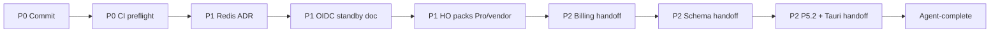

# Harden staging P0→P2 — Implementation Plan

> **For agentic workers:** REQUIRED SUB-SKILL: Use `superpowers:executing-plans` (or subagent-driven-development) task-by-task. Checkboxes track progress.

**Goal:** Từ trạng thái DOC_GATE scope C + Auth0 PASS, hoàn thiện hàng đợi harden-staging theo ưu tiên P0→P1→P2 — agent chạy hết phần **agent-auto**; dừng có ledger tại mỗi **HO-gate**.

**Architecture:** Một plan tuần tự. P0 = git + CI evidence. P1 = quyết định vận hành có default an toàn trong cap $25 (Redis N/A v1, OIDC interim standby, Pro/vendor = waiver/await HO). P2 = chỉ **prep/handoff** cho billing/schema/Tauri/P5.2 cho đến khi HO mở gate; không implement feature gated.

**Tech Stack:** git/gh, GitHub Actions, Fly, Auth0, Supabase Free, docs under `backend/docs/release/`.

**Prior analysis:** canvas `next-work-analysis.canvas.tsx` · scope C plan `2026-07-24-doc-gate-code-complete-to-100.md`

## Global Constraints

- Never commit secrets (`.env.staging`, `.auth0-staging.env`).
- Cloud cap ~$25/mo — no PITR add-on ~$100; no unsolicited Pro upgrade.
- Production go-live requires explicit HO command — never imply authorized.
- Fly API app: `phan-mem-ban-hang-online-api`.
- Do not implement Billing UI bind / schema P6–P9 / Tauri vault / P5.2 contract without HO gate open.
- Agent-auto continues past HO-gates by recording BLOCKED-HO and moving to next agent-auto task.
- Commits allowed for this plan (HO asked plan + auto-run P0→P2). Prefer Vietnamese commit messages matching repo style. No force-push; no amend of others' commits.

## Completion definition

| Tier | Meaning |
|------|---------|
| **Agent-complete** | All tasks marked agent-auto Done; HO-gates listed in ledger with status BLOCKED-HO or WAIVED |
| **Fully complete** | Agent-complete + HO has answered Redis/Pro/vendor/billing/schema/Tauri/go-live as applicable |

This plan targets **Agent-complete** unless HO unblocks mid-run.

## File map

| Path | Role |
|------|------|
| `.github/workflows/staging-preflight.yml` | Optional Fly deploy (already) |
| `backend/tools/verify-staging-scope-c.mjs` | Staging standard check |
| `backend/docs/release/ADR-014-redis-staging-v1.md` (new) | Redis N/A / optional decision |
| `backend/docs/release/A-TO-F-EXECUTION-STATUS.md` | Live status |
| `backend/docs/collaboration/OUTBOX.md` | Evidence |
| `backend/docs/release/HO-NEXT-P0-P2.md` (new) | HO one-pager for blocked gates |
| `.superpowers/sdd/progress-harden-p0-p2.md` | Execution ledger |

---

## P0 — Git hygiene + CI

### Task 1: Commit scope C / Auth0 / verify (agent-auto)

**Files:** Include product/docs/tools/workflow/CSV/tickets; exclude `.cursor/`, secrets, optional noisy `.superpowers/sdd/task-*-review-pkg.md` if policy is scratch-only — **do** include `progress-doc-gate-c.md`, plans/specs under `backend/docs/superpowers/`, `verify-staging-scope-c.mjs`. Review `pnpm-lock.yaml` — include only if change is intentional/required.

- [x] **Step 1:** `git status` / `git diff --stat` — classify files
- [x] **Step 2:** Stage allowed paths; leave secrets untracked
- [x] **Step 3:** Commit with message focusing on why (scope C close + Auth0 staging + verify)
- [x] **Step 4:** `git status` clean for staged set (or only intentional leftovers)
- [x] **Step 5:** Append ledger Task 1 complete

### Task 2: Push + staging-preflight evidence (agent-auto; HO if secrets missing)

- [x] **Step 1:** `git push -u` if branch tracking needs it (main: push if ahead; do not force)
- [x] **Step 2:** Trigger `gh workflow run staging-preflight.yml -f confirm_phase_a=PASS -f run_migrate=true -f run_health=true -f run_fly_deploy=false` (or document BLOCKED if no `gh` auth / missing GH Environment secrets)
- [x] **Step 3:** Record run URL in `HARDENING-H5-EVIDENCE.md` + OUTBOX (no secrets)
- [x] **Step 4:** Ledger Task 2

---

## P1 — Vận hành staging (defaults trong cap)

### Task 3: Redis staging v1 ADR (agent-auto)

**Decision default (no HO reply yet):** Staging v1 = Redis **optional / N/A** — API Auth0 path does not require Redis; worker/scheduler remain best-effort when unset. Preflight keeps warn, not fail.

- [x] **Step 1:** Create `backend/docs/release/ADR-014-redis-staging-v1.md` with Context / Decision / Consequences
- [x] **Step 2:** Link from A-TO-F + update preflight comment or docs note “warn expected”
- [x] **Step 3:** OUTBOX one line; ledger

### Task 4: Interim OIDC standby policy (agent-auto; destroy = HO)

**Decision default:** Keep `phan-mem-ban-hang-online-oidc` as **rollback standby**; do **not** destroy without HO. Document how to scale to zero / destroy later.

- [x] **Step 1:** Add section to `HARDENING-H1-AUTH0.md` or A-TO-F: standby policy + optional destroy command for HO
- [x] **Step 2:** OUTBOX; ledger

### Task 5: Pro / vendor HO pack refresh (agent-auto; spend = HO-gate)

- [x] **Step 1:** Write `backend/docs/release/HO-NEXT-P0-P2.md` — one page: Pro ($25) vs Free waiver; no PITR $100; vendor optional; Billing/Tauri/schema gates
- [x] **Step 2:** Point A-TO-F “HO còn lại” at this file
- [x] **Step 3:** Ledger — mark Pro/vendor **BLOCKED-HO** (not agent-done as spent)

---

## P2 — Product prep (no gated implementation)

### Task 6: Billing / notifications handoff (agent-auto)

- [x] **Step 1:** Update `frontend/docs/collaboration/CONTRACT_GAP_BILLING_NOTIFICATIONS.md` status section with “Ready for HO approve bind” + link HO-NEXT
- [x] **Step 2:** OUTBOX: needs HO approve bind
- [x] **Step 3:** Ledger BLOCKED-HO for implementation

### Task 7: Schema P6–P9 handoff (agent-auto)

- [x] **Step 1:** Short `backend/docs/release/SCHEMA-GATES-P6-P9.md` listing `shipping_labels`, `support_tickets`, `job_runs` (+ note pgvector) and “open gate = HO reply”
- [x] **Step 2:** Link data-dictionary Not started rows to this doc
- [x] **Step 3:** Ledger BLOCKED-HO

### Task 8: P5.2 audit + Tauri handoff (agent-auto)

- [x] **Step 1:** Note in HO-NEXT: P5.2 dual-write contract window; Tauri ADR-FE-014 CTA → native needs HO
- [x] **Step 2:** Ledger BLOCKED-HO for both
- [x] **Step 3:** Final `verify-staging-scope-c.mjs` still 16/16; append Agent-complete to `progress-harden-p0-p2.md` + autonomous-progress

---

## Self-review vs next-work analysis

| P0–P2 item from analysis | Task |
|--------------------------|------|
| Commit/PR | 1 |
| CI staging-preflight | 2 |
| Redis decision | 3 (default N/A) |
| Interim OIDC | 4 (standby) |
| Vendor / Pro | 5 (HO pack; blocked spend) |
| Billing UI | 6 (handoff) |
| Schema gates | 7 (handoff) |
| P5.2 / Tauri | 8 (handoff) |
| Prod go-live | Explicitly out of agent-complete |
